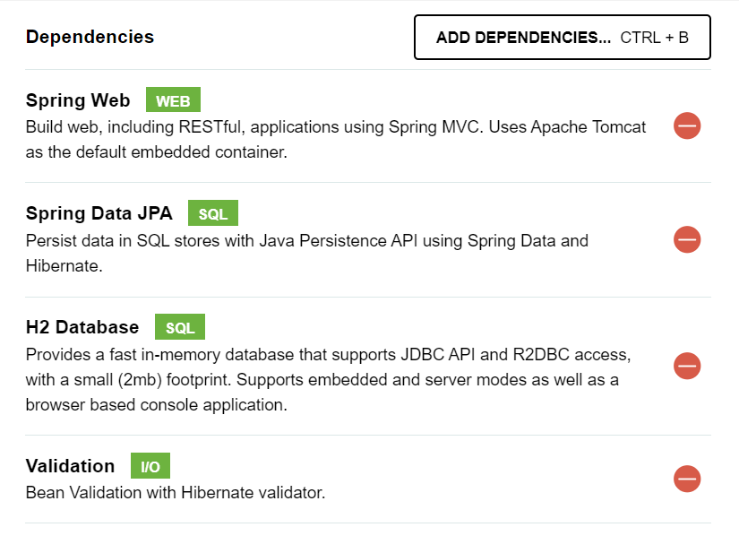

* Dependencias:

* build.gradle:
  * 	implementation 'org.mapstruct:mapstruct:1.5.5.Final'
  
        annotationProcessor 'org.mapstruct:mapstruct-processor:1.5.5.Final'
  

REPOSITORIO: 

- @Repository
* Para mantener aislada la capa de dominio de la de infraestructura nos creamos nuestra
propia interface de persistencia, dentro de domain: usuarioPersistence
* Para poder hacer uso de los metodos de JpaRepository en infraestructura -> persistencia
nos hacemos una interface que extienda esa interface: UsuarioRepository
* El ultimo paso es crear en infraestructura -> persistencia una clase que implementa nuestra interface
UsuarioPersistence y tiene una propiedad privada de UsuarioRepository.

De esta forma hacemos uso de los metodos de jpa con la propiedad de UsuarioRepository y desvinculamos
nuestro dominio.

DTO:

- Implementar Serializable
- Constructor vacio

Service:

- En la clase que implementa la interface UsuarioService poner la anotacion Service

RestController:

- propiedad de la interface service

- anotacion @RestController